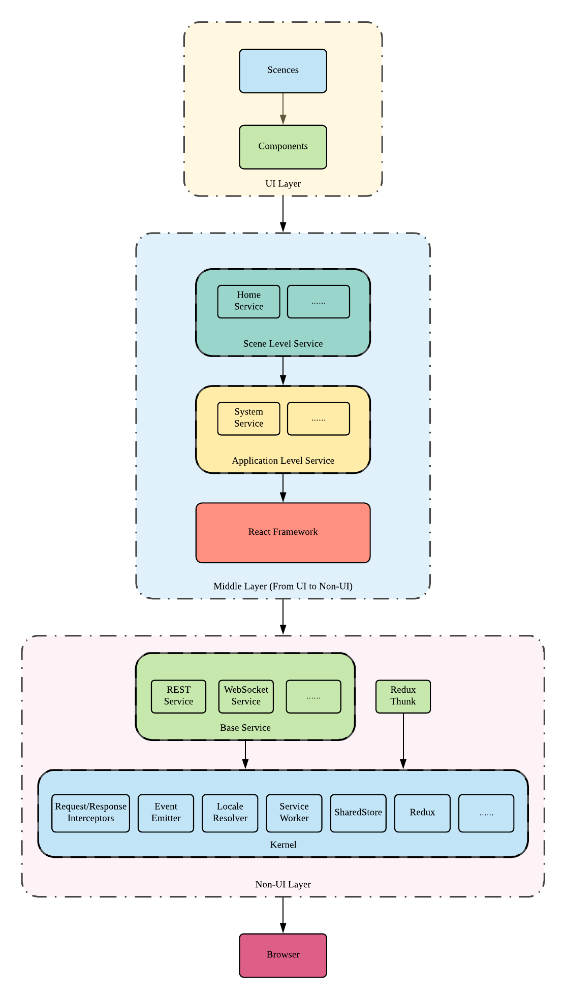

# RTAlpha Web

This is a react project. Before you start working on this project, please read this instruction first.

## 1. File Structure

Please read [How to better organize your React applications](https://medium.com/@alexmngn/how-to-better-organize-your-react-applications-2fd3ea1920f1) to understand the file structure we use for this project.

## 2. Use Absolute Paths

Absolute path import helps easier file nevigation and moving. All paths are configured to be relative to `src` in the root directory.

Do NOT do

> import MyComponent from "../../../components/my-component"

but do

> import MyComponent from "components/my-component"

## 3. React/JSX Style Guide

### 3.1. Naming Convention

#### 3.1.1. Use lowercased words and hyphen to join words for

- Directory: `image-asset`
- File: `user-service.js`
- URL: `www.rtalpha.com/user-centre`

#### 3.1.2. Use lowerCamelCase notation for

- URL query parameter: `www.rtalpha.com/user-centre?firstName=xxx`
- JavaScript Variable: `let firstName`
- Key of locale files: `errorHint: Error`

#### 3.1.3. Use uppercased words and underscore to join words for

- JavaScript constants: `THIS_IS_A_CONSTANT`

### 3.2. File Extension

Use `.js` for normal JavaScript files, and `.jsx` extension for React components, which gains additional support of plugins and editiors.

## 4. Editor Plugins

Please install the following plugins for the editor you use.

- [Babel](https://babeljs.io/docs/en/editors/) for syntax highlighting
- [ESLint](https://eslint.org/docs/user-guide/integrations) for JavaScript and JSX linting
- [Prettier](https://prettier.io/docs/en/editors.html) for code formatting (`please enable auto save feature of your editor`)
- [Styled Component Syntax Highlighting](https://www.styled-components.com/docs/tooling#syntax-highlighting) for syntax highlighting in Styled Components

## 5. Visual Studio Code

[Visual Studio Code](https://code.visualstudio.com/) is the preferred edtior. After install [Prettier](https://marketplace.visualstudio.com/items?itemName=esbenp.prettier-vscode), [ESLint](https://marketplace.visualstudio.com/items?itemName=dbaeumer.vscode-eslint#overview) and [Sublime Babel](https://marketplace.visualstudio.com/items?itemName=joshpeng.sublime-babel-vscode), please copy the following configurations to the project root (`DO NOT` commit them but keep them for yourself):

```json
├── .vscode
│   ├── launch.json
│   └── settings.json
├── jsconfig.json
└── src
```

- Create a file named `jsconfig.json` with content:

  ```json
  {
    "compilerOptions": {
      "target": "ES6",
      "module": "commonjs",
      "allowSyntheticDefaultImports": true,
      "baseUrl": "./src/",
      "paths": { "*": ["*"] }
    },
    "typeAcquisition": {
      "include": ["jest"]
    },
    "exclude": ["node_modules", "**/node_modules/*"]
  }
  ```

- Create two files `settings.json` and `launch.json` in directory `.vscode`:

  ```json
  {
    // This is for settings.json
    "files.associations": { "*.js": "javascriptreact" },
    "editor.formatOnSave": true
  }
  ```

  ```json
  {
    // This is for launch.json
    "version": "0.2.0",
    "configurations": [
      {
        "type": "node",
        "request": "launch",
        "name": "Debug Jest Test",
        "runtimeExecutable": "${workspaceFolder}/node_modules/.bin/react-scripts",
        "args": ["test", "--env=jsdom", "--runInBand", "--modulePaths=src"],
        "cwd": "${workspaceFolder}",
        "console": "integratedTerminal",
        "protocol": "inspector",
        "internalConsoleOptions": "neverOpen"
      },
      {
        "type": "chrome",
        "request": "launch",
        "name": "Launch Chrome For Debug",
        "url": "http://localhost:3000",
        "webRoot": "${workspaceFolder}"
      }
    ]
  }
  ```

After the above configuration, you are encouraged to install the following plugins:

- [GitLens](https://marketplace.visualstudio.com/items?itemName=eamodio.gitlens)
- [Git History](https://marketplace.visualstudio.com/items?itemName=donjayamanne.githistory)
- [Debugger for Chrome](https://marketplace.visualstudio.com/items?itemName=msjsdiag.debugger-for-chrome)
- [Visual Studio IntelliCode](https://marketplace.visualstudio.com/items?itemName=VisualStudioExptTeam.vscodeintellicode)
- [Jest](https://marketplace.visualstudio.com/items?itemName=Orta.vscode-jest) (for test only)

## 6. Chrome

We recommend to use Chrome with the following extensions for development:

- [Redux DevTools](https://chrome.google.com/webstore/detail/redux-devtools/lmhkpmbekcpmknklioeibfkpmmfibljd)
- [React Developer Tools](https://chrome.google.com/webstore/detail/react-developer-tools/fmkadmapgofadopljbjfkapdkoienihi)
- [Immutable.js Object Formatter](https://chrome.google.com/webstore/detail/immutablejs-object-format/hgldghadipiblonfkkicmgcbbijnpeog)

## 7. Production and Development Enviornments

`.env.development` and `.env.production` are configuration files for development and production enviornments respectively. When doing development, you should configure the right settings for it, e.g. set the right URL of API server like

> `REACT_APP_API_SERVER_URL=http://localhost:3000`

in `.env.development`

## 8. How to build a production release

Before building a new version, the production configuration must be updated in `.env.production`. After that, you can start to build using the following command:

> npm run build

This command will result in:

> rtalpha-web@0.9.7 build target_path

The version, e.g. 0.9.7, in package.json will be used to build the release. After building, this version will be upgraded to a new number which is shown in the command line. `DO NOT` forget to commit package.json when the build is done.

<br><br><br><br>

# Architecture



## 1. Overview

RTAlpha Web is designed with the `component-oriented` concept, and composed of `UI Layer`, `Middle Layer` and `Non-UI Layer`.

| Layer        | React Based | Automation Test |
| ------------ | :---------: | --------------: |
| UI Layer     |     Yes     |       Difficult |
| Middle Layer |   Partial   |          Median |
| Non-UI Layer |     No      |            Easy |

### 1.1. UI Layer

This layer relies heavily on HTML, CSS and React. It is where end users interact with RTAlpha Web, so it is not that easy to apply unit testing and other automation testing to this layer.

### 1.2. Middle Layer

This layer is where RTAlpha Web transits from UI Layer to Non-UI Layer. Therefore, there may be UI and Non-UI code mixed in one component.

### 1.3. Non-UI Layer

This layer is a `pure JavaScript` layer and isolated from React. The automation testing, e.g. unit testing will be applied to this layer to facilitate CI/CD.

## 2. Hierarchy

From the architecture diagram, UI Layer is based on Middle Layer and Non-UI Layer, and Middle Layer relies on Non-UI Layer. Each layer is composed of different components respectively.

Components on the same level are marked with the same colors. The components are visible to those components which are on the same or higher levels. That means components are able to call other components which are on the same or lower levels. For example, REST Service and WebSocket Service are allowed to call each other, and both of them are legal to use SharedStore. However, REST Service will never utilize React Framework or Application Level Service.

## 3. Storage

There are two kinds of global Storage, i.e. Redux and SharedStore. If data is intended to cause page to self-update, it should be kept in Redux, otherwise SharedStore is the right place.

## 4. Model & View

Views on UI Layer are `ONLY` allowed to update virtual DOM via REST Service, WebSocket Service, Redux and SharedStore, i.e. views change data, and data being changed will cause UI to refresh itself.
